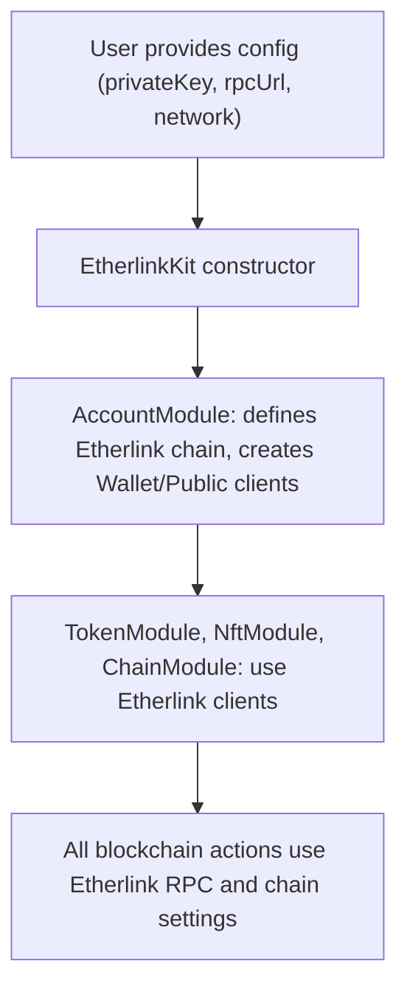

# EtherlinkKit Technical Documentation

## 1. Core Structure: EtherlinkKit Class
The main entry point is the `EtherlinkKit` class (`src/EtherlinkKit.ts`).
This class orchestrates four modules:
- `AccountModule`
- `TokenModule`
- `NftModule`
- `ChainModule`
Each module provides a set of blockchain interaction features, all tailored for the Etherlink network.

## 2. Network Integration: Etherlink Chains
In `src/modules/account/index.ts`, Etherlink-specific chain definitions are created using the viem library's `defineChain`:
- Testnet and Mainnet are both defined, with their unique chain IDs, RPC URLs, and block explorer URLs.

**Example:**
```ts
const etherlinkTestnet = defineChain({
  id: 128123,
  name: 'Etherlink Testnet',
  nativeCurrency: { name: 'Tezos', symbol: 'XTZ', decimals: 18 },
  rpcUrls: { default: { http: ['https://node.ghostnet.etherlink.com'] } },
  blockExplorers: { default: { name: 'Etherlink Testnet Explorer', url: 'https://testnet-explorer.etherlink.com' } },
});
```
The same is done for Mainnet, with its own parameters.

## 3. Client Initialization
When you instantiate `EtherlinkKit`, you provide a config with:
- `privateKey` (must be 0x-prefixed)
- `rpcUrl` (the Etherlink node endpoint)
- `network` (optional, defaults to testnet)

The `AccountModule` uses this config to:
- Select the correct Etherlink chain (mainnet or testnet).
- Create a `WalletClient` and `PublicClient` using viem, both configured for Etherlink.

**Example:**
```ts
this.client = createWalletClient({
  account: this.account,
  chain: chain,
  transport: http(config.rpcUrl)
});
this.publicClient = createPublicClient({
  chain: chain,
  transport: http(config.rpcUrl)
});
```

## 4. Module Responsibilities
- **AccountModule:** Handles wallet creation, address management, balance queries, and message signing, all on Etherlink.
- **TokenModule:** Interacts with ERC20 tokens on Etherlink (transfer, mint, burn, balance).
- **NftModule:** (Not shown in full, but by analogy) Handles NFT operations on Etherlink.
- **ChainModule:** Allows reading from and executing contracts, simulating transactions, etc., all using Etherlink's chain configuration.

## 5. How Etherlink is Used Technically
- **Chain Definitions:** Etherlink is explicitly defined as a chain for the viem client, with all network-specific parameters.
- **RPC Usage:** All blockchain interactions are routed through Etherlink's RPC endpoints.
- **Account Management:** Private keys and addresses are managed in a way compatible with Etherlink's EVM-like environment.
- **Contract Interactions:** All contract calls (read/write/simulate) are performed on Etherlink, using its chain ID and network settings.

## 6. Summary Diagram


---

## In summary
The `etherlink-kit` leverages the viem library to define Etherlink as a custom EVM-compatible chain, initializes all blockchain clients to use Etherlink's endpoints, and exposes high-level modules for account, token, NFT, and contract operations, all specifically configured for the Etherlink network.